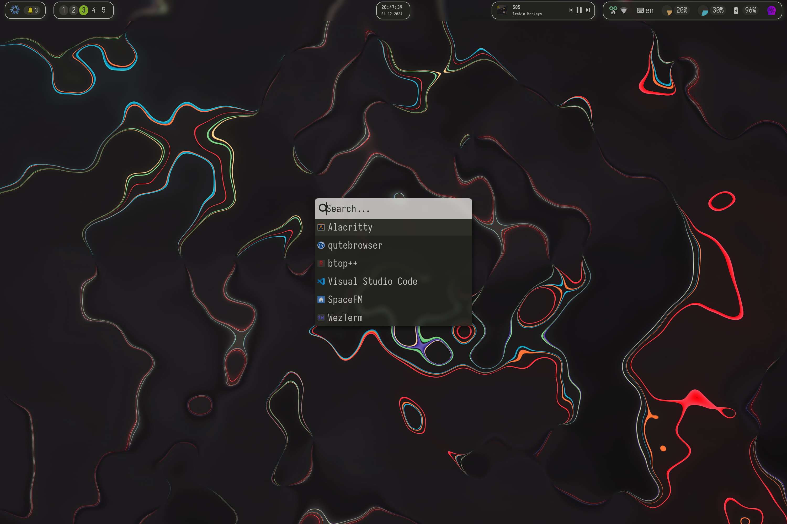
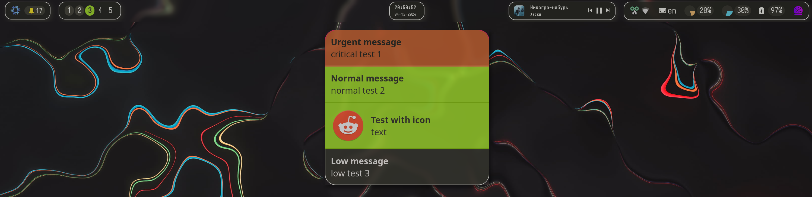
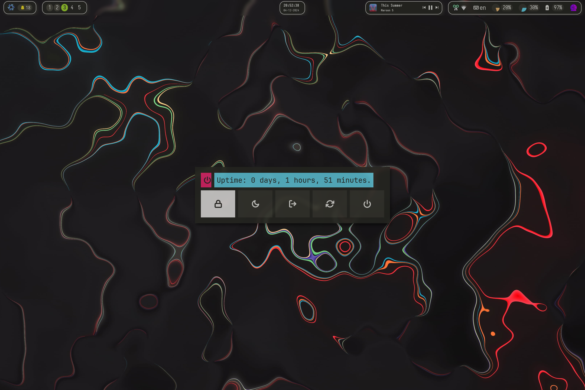
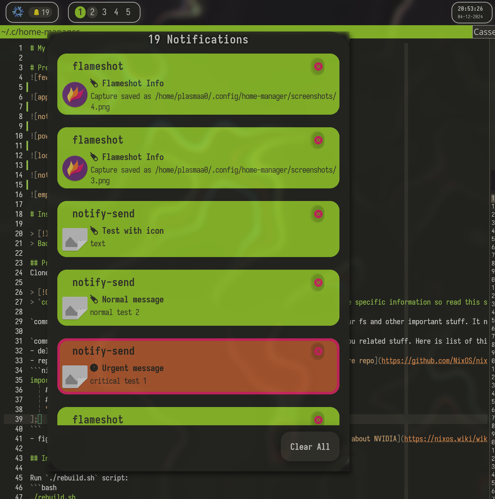
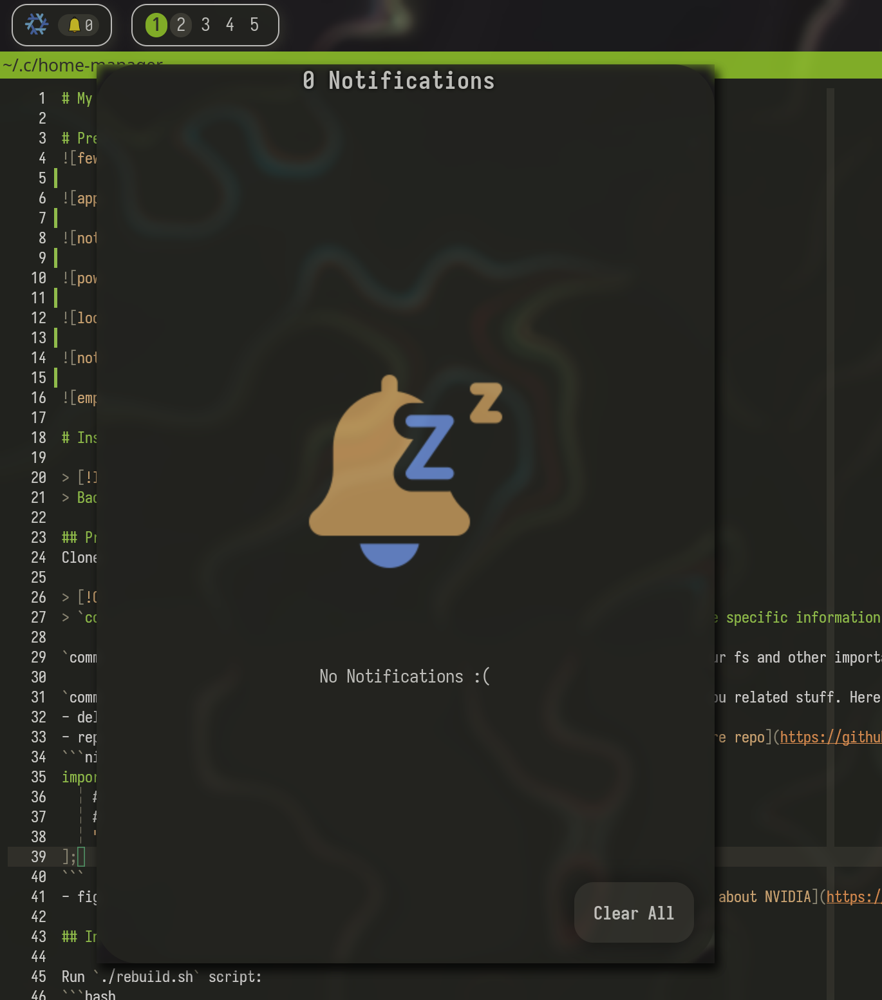

<h1 align="center">
    
   <br>
      My NixOS system
   <br>
   
    <br>
   <div align="center">

   <div align="center">
      <p></p>
      <div align="center">
         <a href="https://github.com/plasmaa0/nixos-config/stargazers">
            
         </a>
         <a href="https://github.com/plasmaa0/nixos-config/">
            
         </a>
         <a = href="https://nixos.org">
            
         </a>
         <a href="https://github.com/plasmaa0/nixos-config/blob/main/LICENSE">
            
         </a>
      </div>
      <br>
   </div>
</h1>

> [!CAUTION]
> This `README.md` is highly out of date

<h1 align="center"> Preview </h1>








lockscreen


displayManager (sddm)






# Installation steps

> [!IMPORTANT] 
> Backup your `/etc/nixos` folder before installation.

## Preparing
Clone repo in any folder you'd like. 

> [!CAUTION]
> `common/hardware-configuration.nix` and `common/I_HATE_NVIDIA.nix` contain hardware specific information so read this section as carefully as possible to avoid bad thigs

`common/hardware-configuration.nix` specifies how partitions are being mounted to your fs and other important stuff. It needs to be replaced with config generated by nixos for your PC. It's either stored in `/etc/nixos` or you can generate it with `nixos-generate-config`.

`common/I_HATE_NVIDIA.nix` specifies nvidia gpu driver installation and some other gpu related stuff. Here is list of things you can do with it to make it match your hardware:
- delete it (and import of it in `common/configuration.nix`);
- replace path to your device specific configuration if you find it in [nixos-hardware repo](https://github.com/NixOS/nixos-hardware);
```nix
imports = [
    # -------------------replace here------
    # ------------------- \/  \/  \/ ------
    "${nixos-hardware}/huawei/machc-wa"
];
```
- figure out by yourself what you need (IF you need) to do with your gpu [NixOS wiki about NVIDIA](https://nixos.wiki/wiki/Nvidia).

## Installing

Run `./scripts/rebuild-boot.sh` script and reboot:
```bash
./scripts/rebuild-boot.sh && reboot
```

# Personal data
Be careful when sharing these files, they contain personal information:
- `home.nix` imports `secrets/secrets.nix` which sets up secrets e.g. github token:
```nix
{...}:{
  nix.settings.access-tokens = [
    "github.com=........"
  ];
  programs.git = {
    userName  = "...";
    userEmail = "...";
  };
}
```

My method of managing secrets is definitely not the best and secure.
Check out this project: [sops-nix](https://github.com/Mic92/sops-nix) to deal with secrets management.

# Features

Apps, their features and files that contain their configuration

## Global
Configs in `common` directory are described below.

- `configuration.nix` Set up i3 session, gdm, keyboard layouts, touchpad scroll direction, time zones, 2x scaling (i have hi-dpi screen), automatic nix garbage collection. Enables gnupg, ssh.

- `bootloader.nix` GRUB 2 with [theme from AdisonCavani](https://github.com/AdisonCavani/distro-grub-themes). Also you can uncomment plymouth config.

- `fonts.nix` Installs my favourite fonts (e.g. Iosevka), some fonts are installed in their nerd versions. Also sets default system fonts:
  - serif: `IosevkaTermSlab`;
  - sansSerif: `Arimo`;
  - monospace: `Iosevka`;
  - emoji: `OpenMoji Color`.

- `power_management.nix` Enables `thermald`, `upower`, `tlp`. Configuration is just basic tweaks to make my laptop's battery life longer.

- `I_HATE_NVIDIA.nix` Installs ___hardware specific___ drivers for nvidia gpu. You definitely need to check out official repo for hardware specific configs: [repo](https://github.com/NixOS/nixos-hardware).

- `hardware-configuration.nix` All left default (generated during installation) except for mounting `/home` directory which i store at separate partition for the sake of distrohopping. Also configures swap and zram.

## Apps
Configs in `nix_modules` directory are described below.

Most of the apps listed below are configured using [home-manager](https://nix-community.github.io/home-manager/) and themed with [stylix](https://stylix.danth.me/index.html). When trying to reconfigure something look in corresponding `nix_modules/<app_you_want>.nix` and `dotfiles/<app_you_want>`.

`home.nix` configures apps to install, sets github token for home-manager to fetch github without restrictions, enables:
- `flameshot` screenshot daemon
- `copyq` clipboard management tool
- `poweralertd` daemon which notifies you some info about power of your battery and connected devices

List of apps configured (links provided):
- `alacritty.nix` Great terminal [site](https://alacritty.org/);
- `autorandr.nix` [autorandr](https://github.com/phillipberndt/autorandr) can save your monitor configurations and quickly change them. Very useful for laptops if you connect them to monitor at different places;
- `betterlockscreen.nix` Nice looking and highly customizable lockscreen (uses i3lock under the hood) [link](https://github.com/betterlockscreen/betterlockscreen);
- `dunst.nix` Dunst notification daemon [link](https://github.com/dunst-project/dunst);
- `eww.nix` Highly customizable widgets framework. Made a bar with it. [link](https://elkowar.github.io/eww/);
- `fastfetch.nix` System fetch with my custom layout and png nixos logo (__supported by kitty/wezterm__) [link](https://github.com/fastfetch-cli/fastfetch);
- `fish.nix` Fish shell. Almost entire config stolen from my previous [Garuda Linux](https://garudalinux.org/) installation. [link](https://fishshell.com/);
- `git.nix` You know what git is. Configured gpg signing by default and some credentials. Also enables amazing git tui [`gitui`](https://github.com/extrawurst/gitui);
- `helix.nix` ~vim killer~ Pretty editor i use as drop-in replacement for vim in some cases. Configured essential for me language servers (latex, python, c/c++, etc...). Theme is somewhat tweaked from what default stylix gave me. [link](https://helix-editor.com/);
- `i3.nix` My favourite window manager. Theme is custom build from stylix colors. Configures keybindings, essential appearance settings, starts up apps (flameshot, dunst, etc). [link](https://i3wm.org/);
- `mime_apps.nix` Configures default apps for opening some file types (like pdf -> evince);
- `nixvim.nix` Neovim configuration in "nix" way. Configuration in progres [link](https://github.com/nix-community/nixvim);
- `nnn.nix` cli file manager. Configuration in progress [link](https://github.com/jarun/nnn);
- `picom.nix` compositor. By default you'll get the default "light" configuration, but you may uncomment my custom made config which provides animations and some other settings (more power-consuming) [link](https://github.com/yshui/picom);
- `polybar.nix` My old configuration of polybar which i don't use now (switched to eww) [link](https://github.com/polybar/polybar);
- `rofi.nix` dmenu alternative for popup menus like application launcher, powermenu, etc. [link](https://github.com/polybar/polybar). Using themes from this [link](https://github.com/adi1090x/rofi);
- `starship.nix` Beautiful shell prompt i use. Like fish, config is stolen from my previous [Garuda Linux](https://garudalinux.org/) installation (i guess it's almost default) [link](https://starship.rs/);
- `stylix.nix` Configures [stylix](https://stylix.danth.me/index.html) - a NixOS module which applies the same colour scheme, font and wallpaper to a range of applications and desktop environments. Sets up systemwide dark mode, color scheme, wallpaper, icon-pack (Papirus Dark), cursor-pack (Bibata Modern Ice), fonts. [link](https://stylix.danth.me/);
- `wezterm.nix` My favourite terminal with multiplexer capabilities. [link](https://wezfurlong.org/wezterm/index.html).

# Theming

To install more fonts add them to `common/fonts.nix` (this will just install them but not apply them everywhere). To apply fonts everywhere use stylix as described below.

To set the theme, wallpaper, fonts, cursors, icons you need to edit it in `nix_modules/stylix.nix`. More details at [stylix wiki](https://stylix.danth.me/).

If `stylix.base16Scheme` is not specified, stylix will generate your colorscheme from colors of your wallpaper (`stylix.image`) but in my opinion colorschemes made using this method is pretty bad (very low contrast, narrow spectrum of colors from dark to bright, few or none of 'highlight' colors that distinguish themselves from other).

Check out `configuration/wallpapers` directory for wallpapers that i use.

> [!NOTE]  
> Applications will get their theme from stylix almost in every case except for the apps listed below. I tweaked colors which they get so their look may be bad.

List of applications with colors tweaked by me:
- `i3`
- `eww`
- `rofi`
- `dunst`
- `helix`
- `betterlockscreen`

# TODO
- [ ] maintain `README.md`
- [ ] sops-nix secret management
- [ ] kitty theme recolor
- [ ] i3 resize mode show in eww
- [ ] show caps lock

# In case of emergency
## Recovery steps.
Load from usb. (In debug mode you won't be able to connect to wifi, so i'd prefer default mode)
### Mount everything:
1. As in `hardware-configuration.nix` (like with impermanence):
```bash
mount -t tmpfs -o "defaults,size=25%,mode=755" tmpfs /mnt

mkdir -p /mnt/home
mount -t tmpfs -o "defaults,size=25%,mode=755" tmpfs /mnt/home

mkdir -p /mnt/persist/home
mount /dev/disk/by-uuid/74219b09-f02e-43f9-a15b-375ff4037772 /mnt/persist
mount /dev/disk/by-uuid/12d128c8-46ef-4b58-9c59-f7cc2ce799c3 /mnt/persist/home

mkdir -p /mnt/boot
mount -o "fmask=0077,dmask=0077" /dev/disk/by-uuid/B24C-64BF /mnt/boot
```
2. Or in a simple way:
```bash
mkdir -p /mnt/home
mount /dev/disk/by-uuid/74219b09-f02e-43f9-a15b-375ff4037772 /mnt
mount /dev/disk/by-uuid/12d128c8-46ef-4b58-9c59-f7cc2ce799c3 /mnt/home

mkdir -p /mnt/boot
mount -o "fmask=0077,dmask=0077" /dev/disk/by-uuid/B24C-64BF /mnt/boot
```
3. Or even simpler (if you haven't splitted `/home` and `/`)
```bash
mount /dev/disk/by-uuid/74219b09-f02e-43f9-a15b-375ff4037772 /mnt

mkdir -p /mnt/boot
mount -o "fmask=0077,dmask=0077" /dev/disk/by-uuid/B24C-64BF /mnt/boot
```
### Activate and enter your system
```bash
chroot /mnt /nix/var/nix/profiles/system/activate
chroot /mnt /run/current-system/sw/bin/bash
# any recovery steps needed, for example:
passwd
```
Alternatively look into `nix-enter`
