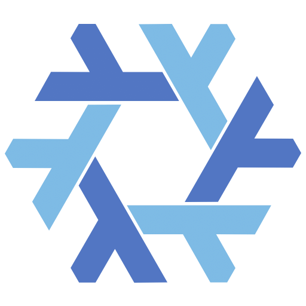
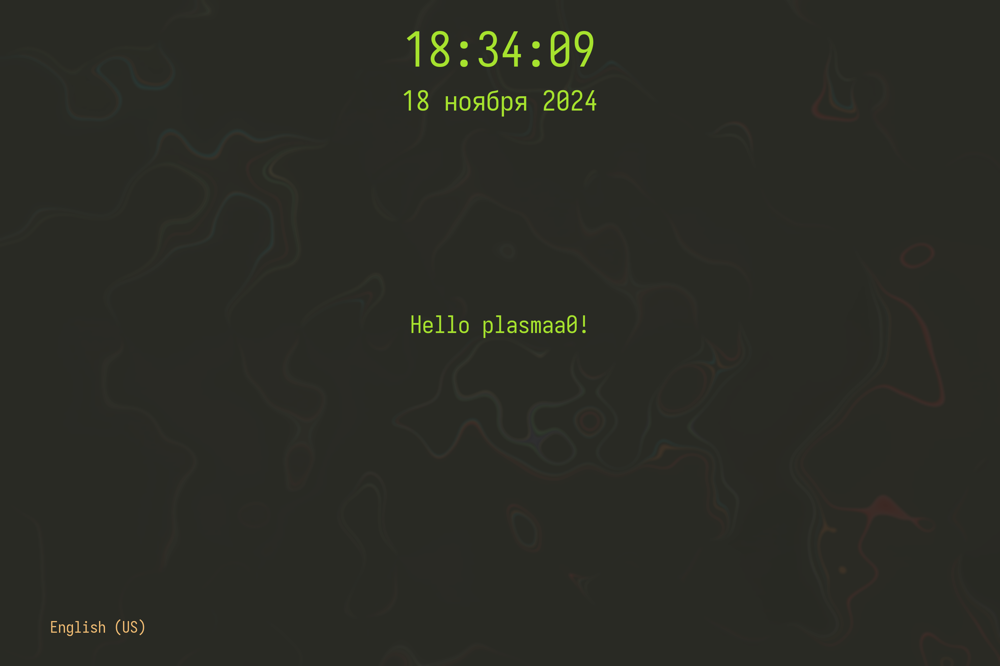
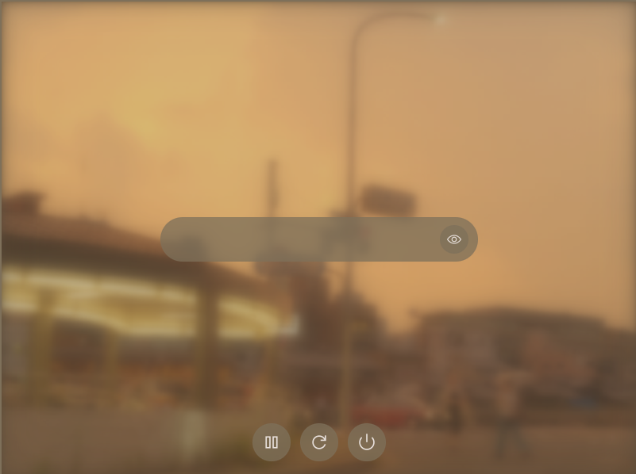

<h1 align="center">
   
   <br>
   NixOS Configuration
   <br>
   
   <br>
   <div align="center">
      <a href="https://github.com/plasmaa0/nixos-config/stargazers">
         
      </a>
      <a href="https://github.com/plasmaa0/nixos-config/">
         
      </a>
      <a href="https://nixos.org">
         
      </a>
      <a href="https://github.com/plasmaa0/nixos-config/blob/main/LICENSE">
         
      </a>
   </div>
   <br>
</h1>

<p align="center">
  <b>Personal NixOS + home-manager config</b> -- flake-parts module tree, sops-nix secrets,
  impermanence root, stylix theming, Secure Boot, and a fully themed desktop (i3/eww/rofi).
  Two hosts: <code>zep</code> (ASUS ROG Zephyrus G16, NVIDIA Optimus) and <code>nb</code> (old Huawei).
</p>

---

## Screenshots

<details open>
<summary><b>Desktop Preview</b></summary>


<br>
<sub>helix editor + btop system monitor + rmpc MPD client, all themed via stylix</sub>

</details>

<details>
<summary><b>Wallpaper Gallery</b></summary>


</details>

<details>
<summary><b>Coding</b></summary>


</details>

<details>
<summary><b>Launcher & Powermenu</b></summary>

Reimagined <a href="https://github.com/adi1090x/rofi">adi1090x rofi configs</a>


</details>

<details>
<summary><b>Lockscreen & Display Manager</b></summary>

(betterlockscreen + obscure-sddm-theme)




</details>

---

## Architecture

<p align="center">
  <code>configuration/flake.nix</code> -- entry point
</p>

```
configuration/
  flake.nix          # importTree(./modules) -> mkFlake (flake-parts)
  flake.lock
  modules/
    parts.nix        # systems, allowUnfree, home-manager flake module
    devshell.nix     # devshell: just, alejandra, statix, deadnix, opencode
    secrets/         # sops-nix secrets (standalone age keys)
    hosts/           # per-host nixosConfigurations (zep, nb)
    users/           # homeModules.plasmaa0 (~55 module imports)
    features/        # all NixOS + HM feature modules
```

### Module Export Convention

| Type | Pattern | Example |
|------|---------|---------|
| NixOS (flat .nix) | `nixosModules.<name>` | `bluetooth.nix` -> `nixosModules.bluetooth` |
| HM (dir/default.nix) | `homeModules.<cat>-<sub>-<name>` | `cli/editor/helix/` -> `homeModules.cli-editor-helix` |
| Dual export | both keys in one file | `stylix/stylix.nix`, `secrets/default.nix` |

### Auto-Discovery

Every `.nix` file under `modules/` that is NOT prefixed with `_` is recursively
auto-imported as a flake-parts module. Files starting with `_` are excluded --
use them for split helpers, hardware configs, or theme helpers. Directories
named with `_` are fine (Nix ignores directory names in fileFilter).

---

## Theming

Themes live in `configuration/themes/<polarity>/<name>.nix` as pure attribute
sets (no function wrapper):

```nix
{
  wallpaper = "kyoto.jpg";
  polarity = "dark";
  scheme = "mocha";
}
```

- **polarity**: `"dark"` or `"light"`
- **scheme**: Base16 color scheme name
- **wallpaper**: filename from `configuration/wallpapers/`

The active theme is imported by `features/stylix/stylix.nix`. Switch themes
by changing that import and running `just rebuild-switch`.

**Available themes:**

<details>
<summary><b>Dark (12 themes)</b></summary>

- abstract_waves, anime, desert, forest, glass-blue-hexagons, graphite,
  gruvbox, kyoto, monokai, purple_flowers, simplex, xmas

</details>

<details>
<summary><b>Light (4 themes)</b></summary>

- bliss, desert, grass, pink-lighthouse

</details>

stylix applies the same color scheme, fonts, and wallpaper across the entire
desktop. Stylix targets explicitly disabled: plymouth, i3, helix (custom
tweaked themes instead).

---

## What's Inside

### Notable Configs

| Category | Applications |
|----------|-------------|
| Editor | helix (LSP: LaTeX, Python, C/C++, Typst, Nix, Yuck), markdown-oxide, vscode, texstudio, xournalpp |
| Shell | fish + starship (custom abbrs, aliases, functions, plugins, nix-index-database) |
| Terminals | kitty, wezterm, alacritty |
| WM/Desktop | i3 (custom keybinds, workspaces, modes), eww (status bar + widgets), polybar, rofi, betterlockscreen, dunst, picom, conky |
| Browsers | qutebrowser (Vim-like, keyboard-driven), helium (minimal webview browser) |
| Media | rmpc (MPD client, album art + lyrics), mpd, yandex-music, cassette, zathura, vlc, obs, easyeffects |
| File Mgmt | yazi (terminal file manager, plugins: compress, max-preview, restore, smart-enter, smart-filter) |
| Gaming | steam, prismlauncher/atlauncher (Minecraft), mangohud, heroic |
| Utils | mime (custom file-type handler module), flameshot, copyq, udiskie, autorandr, fastfetch, direnv, gparted |
| Dev | Typst, LaTeX (texlive basic), Python |
| System | impermanence (stateless root), lanzaboote (Secure Boot), sops-nix (secrets), autoUpgrade, garbageCollect, nix-ld, tlp, asusd (ROG), ananicy |
| Hardware | NVIDIA Optimus (zep: offload + powersave specialisation), AMDGPU, bluetooth, printing, ollama, vial (custom keyboards), weylus |

### Secrets (sops-nix)

- **Machine key**: auto-generated at `/var/lib/sops-nix/key.txt` (generated on first boot)
- **Admin key**: `~/.config/sops/age/keys.txt` (persisted via impermanence)
- **Passwords**: hashed, decrypted at activation via `neededForUsers = true`
- **GitHub token**: injected via `system.activationScripts` (sops decrypts at activation time, not build time)
- **Edit**: `sops configuration/modules/secrets/secrets.yaml`
- **Bootstrap**: `sudo configuration/modules/secrets/init.sh`

---

## Build Commands

All via `just`. Commands copy `configuration/*` to `/etc/nixos`, then run
`nixos-rebuild` against `/etc/nixos`.

```
just rebuild-boot              all-checks -> cp -> nixos-rebuild boot
just rebuild-switch            all-checks -> cp -> nixos-rebuild switch
just rebuild-test              all-checks -> cp -> nixos-rebuild test
just rebuild-update            update flake.lock -> rebuild-boot
just rebuild-*-specific HOST   same, targeting /etc/nixos#HOST
just all-checks                format -> check_dead -> lint
just format                    just --fmt + alejandra *.nix
just gc                        nix-collect-garbage -d + switch-to-config boot
just diff                      nvd diff between last 2 system profiles
```

`all-checks` runs: `just --fmt --unstable` + `alejandra --quiet $(fd --extension nix)`
then `deadnix` then `statix check`.

---

## Hosts

### zep (ASUS ROG Zephyrus G16 2024)

- AMD Ryzen + NVIDIA RTX 4060 laptop (Optimus)
- AMDGPU + NVIDIA with prime offload (`powersave` specialisation disables NVIDIA)
- asusd ROG control, 180 DPI HiDPI, 24.11 stateVersion
- Multi-monitor via autorandr, hibernation, tlp

### nb (Old Huawei)

- Intel integrated graphics only -- dedicated NVIDIA module excluded
- 192 DPI HiDPI, 24.05 stateVersion
- Touchpad, power management, automount

---

## Getting Started (Forking)

1. Clone the repo
2. Add your host config in `configuration/modules/hosts/<hostname>/` (see `zep` or `nb`)
3. Add your user config in `configuration/modules/users/<username>.nix`
4. Wire up secrets via sops-nix or replace with your own method
5. Run `just rebuild-switch-specific <hostname>` for first build

---

## Credits

- [Stylix](https://github.com/nix-community/stylix) -- system-wide theming
- [flake-parts](https://github.com/hercules-ci/flake-parts) -- modular flake architecture
- [home-manager](https://nix-community.github.io/home-manager/) -- declarative user config
- [impermanence](https://github.com/nix-community/impermanence) -- stateless root
- [lanzaboote](https://github.com/nix-community/lanzaboote) -- Secure Boot
- [sops-nix](https://github.com/Mic92/sops-nix) -- secrets management
- [adi1090x/rofi](https://github.com/adi1090x/rofi) -- rofi themes
- [obscure-sddm-theme](https://github.com/saatvik333/obscure-sddm-theme) -- SDDM theme

---

<p align="center">
  <i>Licensed under MIT.</i>
</p>
