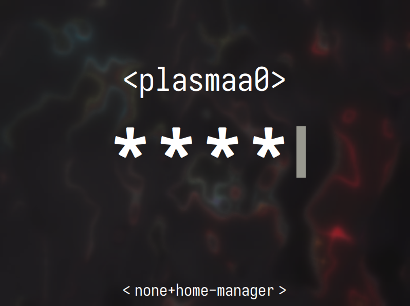

<h1 align="center">
    
   <br>
      My NixOS system
   <br>
   
    <br>
   <div align="center">

   <div align="center">
      <p></p>
      <div align="center">
         <a href="https://github.com/plasmaa0/nixos-config/stargazers">
            
         </a>
         <a href="https://github.com/plasmaa0/nixos-config/">
            
         </a>
         <a = href="https://nixos.org">
            
         </a>
         <a href="https://github.com/plasmaa0/nixos-config/blob/main/LICENSE">
            
         </a>
      </div>
      <br>
   </div>
</h1>

> [!CAUTION]
> This `README.md` is highly out of date

<h1 align="center"> Themes Preview </h1>


On the screenshot:
- [helix](https://github.com/helix-editor/helix) editor
- [btop](https://github.com/aristocratos/btop) system monitor
- [rmpc](https://github.com/mierak/rmpc) mpd client

all with custom themes via [stylix](https://github.com/nix-community/stylix) 🌈

<h2 align="center"> Wallpapers </h2>


<h2 align="center"> Coding </h2>


<h2 align="center"> Launcher and powermenu </h2>

Reimagined [adi1090x rofi configs](https://github.com/adi1090x/rofi)


<h2 align="center"> Lockscreen </h2>

(monokai theme), using [betterlockscreen](https://github.com/betterlockscreen/betterlockscreen)


<h2 align="center"> Display Manager (SDDM) </h2>

my theme: kyoto

sddm theme: [obscure-sddm-theme](https://github.com/saatvik333/obscure-sddm-theme)


# Installation steps

> [!IMPORTANT] 
> Backup your `/etc/nixos` folder before installation.

## Getting started
1. Clone repo in any folder you'd like. 
2. Add your host config in directory `configuration/hosts/<host-name>`
   - it must have `default.nix`
   - may write your own, may use `nixos-generate-config`
   - import common host modules (`configuration/hosts/common`) or add your own into (`configuration/hosts/common/modules`) and import them
   - refer to `configuration/hosts/zep` or `configuration/hosts/nb`
3. Add your user config in directory `configuration/homes/<username>`
   - it must have `default.nix`
   - import common user modules (`configuration/homes/common`) or add your own user-specific
   - refer to `configuration/homes/plasmaa0`
   - create `configuration/homes/common/secrets/secrets.nix` which may be empty (`_: _`), fill it with your secret options
   - put your new user's passowrd into `configuration//homes/common/secrets/<usermame>_password.nix` just as string. for example: ```"qwerty123"```
   - put your intended root's password in the same directory into `root_hashed_password` via `mkpasswd > root_hashed_password`
4. Add entry to `flake.nix`:
```nix
nixosConfigurations = {
  <HOST_NAME> = mkSystem {
    system = "x86_64-linux"; # your architecture
    host = "<HOST_NAME>";
    homes = ["<username>"]; # may contain multiple user names in array
  };
};
```
5. If it's your first build run `just rebuild-switch-specific HOST_NAME`
6. If you already have activated derivation of system then just `just rebuild-switch`
7. *other versions of rebuilding also available (rebuild boot, update, test)

# Personal data
Be careful when sharing these files, they contain personal information:
- `homes/common/default.nix` imports `secrets/secrets.nix` which sets up secrets e.g. github token:
```nix
{...}:{
  nix.settings.access-tokens = [
    "github.com=........"
  ];
  programs.git = {
    userName  = "...";
    userEmail = "...";
  };
}
```

My method of managing secrets is definitely not the best and secure.
Check out this project: [sops-nix](https://github.com/Mic92/sops-nix) to deal with secrets management.

# Features

Most of the apps listed below are configured using [home-manager](https://nix-community.github.io/home-manager/) and themed with [stylix](https://stylix.danth.me/index.html). 


<h2 align="center"> Honorable mentions </h2>
(configs that I'm proud of)

Applications:
- `qutebrowser` minimalist, keyboard-driven web browser with Vim-like keybindings and Qt backend [link](https://qutebrowser.org)
- `zathura` ultra-lightweight PDF/PostScript viewer with minimal UI and powerful keyboard navigation [link](https://pwmt.org/projects/zathura)
- `mime.nix` my custom Nix module for declaratively defining file type handlers (e.g., `pdf → zathura`, `epub → calibre`) - no manual `~/.config/mimeapps.list` editing needed
- `rmpc` lightweight, fast Rust-based MPD client with real-time lyrics fetching and album art display [link](https://github.com/hrkfdn/rmpc)
- `helix` ~vim killer~ modern, fast, modal terminal text editor with built-in LSP, tree-sitter, and ergonomic defaults - my daily driver for code and config. configured essential for me language servers (latex, python, c/c++, etc...). theme is somewhat tweaked from what default stylix gave me.  [link](https://helix-editor.com)
- `fish` + `starship` fish shell with custom completions and functions, paired with starship for a visually rich, dynamic prompt - config ported from my old Garuda Linux setup [link](https://fishshell.com) | [link](https://starship.rs)
- `kitty`/`wezterm` two terminal emulators both configured with matching colors and keybindings [link](https://sw.kovidgoyal.net/kitty) | [link](https://wezfurlong.org/wezterm)
- `betterlockscreen` customizable lockscreen using i3lock + blur effects and dynamic wallpaper switching - visually polished and scriptable [link](https://github.com/betterlockscreen/betterlockscreen)
- `xidlehook` X11 idle hook daemon for screen locking and power management [link](https://github.com/jD91mZM2/xidlehook)
- `fastfetch` system info fetcher with custom NixOS logo [link](https://github.com/fastfetch-cli/fastfetch)
- `polybar` old good status bar [link](https://polybar.github.io)
- `eww` highly customizable, YAML-driven widget engine used to build my modern status bar, music controls, and workspace indicators [link](https://elkowar.github.io/eww)
- `i3status-rust` lightweight, fast system status bar (CPU, RAM, battery, network) [link](https://github.com/greshake/i3status-rust)
- `picom` compositor for drop shadows, transparency, and smooth animations - configured for performance with optional blur effects [link](https://github.com/yshui/picom)
- `rofi` fast, themeable application launcher and power menu - uses Adi1090x themes for a clean, modern look [link](https://github.com/davatorium/rofi)
- `dunst.nix` notification daemon with custom config [link](https://github.com/dunst-project/dunst)
- `i3` Tiling window manager with custom keybindings, workspace layout, and startup scripts - still active for legacy sessions [link](https://i3wm.org)
- `yazi` blazing fast terminal file manager with vim-like keybindings and live preview [link](https://github.com/sxyazi/yazi)
- `lanzaboote` secure boot (YES IT EXISTS ON LINUX) with [link](https://github.com/nix-community/lanzaboote)
- `impermanence` stateless system with empemeral root via [link](https://github.com/nix-community/impermanence)
- `tlp` advanced power management tool for laptops — optimizes battery life with smart CPU, disk, and USB power settings [link](https://linrunner.de/tlp)


<h3 align="center"> Other stuff that powers my system </h3>
(not as interesting as stuff above, but not less useful)

- `flameshot` screenshot daemon;
- `copyq` clipboard management tool;
- `poweralertd` daemon which notifies you some info about power of your battery and connected devices;
- `udiskie` automount devices daemon with nice tray widget;
- `alacritty.nix` great terminal [site](https://alacritty.org/);
- `autorandr.nix` [autorandr](https://github.com/phillipberndt/autorandr) can save your monitor configurations and quickly change them. Very useful for laptops if you connect them to monitor at different places;
- `texstudio` Integrated LaTeX environment with syntax highlighting and real-time preview [link](https://www.texstudio.org)
- `prismlauncher` + `atlauncher` minecraft launchers with modpack support and version management — `prismlauncher` for general use, `atlauncher` for specific modpacks [link](https://prismlauncher.org) | [link](https://atlauncher.com)
- `mangohud` Vulkan/OpenGL overlay for FPS, CPU/GPU stats, and custom performance metrics [link](https://github.com/flightlessmango/MangoHud)
- `steam` valve's gaming platform with library management and Proton compatibility [link](https://store.steampowered.com)
- `direnv` environment switcher for directories — automatically loads/unloads variables based on project context (essential for Nix dev) [link](https://direnv.net)
- `easyeffects` advanced audio effects processor with system-wide equalizer and presets [link](https://github.com/wwmm/easyeffects)
- `vlc` cross-platform multimedia player for video, audio, and streaming [link](https://www.videolan.org)
- nice plymouth themes from adi1090x
- nerd fonts (my favs: Iosevka, Victor, Fantasque...)
- `vial` tool for configuring custom keyboards (fork of qmk as i know)


# Theming
See `configuration/hosts/common/global-stylix.nix` and `configuration/homes/common/user-stylix.nix` configs of stylix are there.

[Stylix](https://stylix.danth.me/index.html) - a NixOS module which applies the same colour scheme, font and wallpaper to a range of applications and desktop environments. Sets up systemwide dark mode, color scheme, wallpaper, icon-pack (Papirus Dark), cursor-pack (Bibata Modern Ice), fonts. [link](https://stylix.danth.me/);

To install more fonts add them to `configuration/hosts/common/fonts.nix` (this will just install them but not apply them everywhere). To apply fonts everywhere use stylix as described below.

To set the theme, wallpaper, fonts, cursors, icons you need to edit it in `configuration/hosts/common/global-stylix.nix`. More details at [stylix wiki](https://stylix.danth.me/).

Stylix color schemes are now centrally managed through predefined theme files. Each theme (e.g., `configuration/themes/dark/kyoto.nix`) explicitly defines:
- `wallpaper`: relative path to wallpaper in `configuration/wallpapers/`
- `polarity`: "dark" or "light" mode enforcement (theme polarity in stylix terms)
- `scheme` (optional): Base16 color scheme name. **When omitted**, Stylix falls back to generating colors from wallpaper pixels - but I recommend against this as auto-generated schemes often suffer from poor contrast, limited color range, and lack of distinctive highlight colors.  

To switch themes:
1. Edit `configuration/hosts/common/global-stylix.nix` to import your desired theme file
2. Set `scheme` explicitly in the theme file for consistent, high-quality color palettes
3. Run `just rebuild-switch` to apply changes system-wide (or `just rebuild-test` just to preview)

All handcrafted themes in `configuration/themes/` guarantee proper contrast ratios and semantic color grouping for both light and dark modes. The wallpaper submodule (`configuration/wallpapers/`) contains all referenced assets.

Check out `configuration/wallpapers` directory for wallpapers that i use.

For 16 color themes: [link](https://tinted-theming.github.io/tinted-gallery/)

> [!NOTE]  
> Applications will get their theme from stylix almost in every case except for the apps listed below. I tweaked colors which they get so their look may be bad.

List of stylix targets which are explicitly disabled:
- `plymouth`
- `i3`
- `helix`

<h2 align="center"> TODO </h2>
- [ ] sops-nix secret management

<h3 align="center"> In case you can't even log into system </h3>
## Recovery steps.
Load from usb. (In debug mode you won't be able to connect to wifi, so i'd prefer default mode)
### Mount everything:
1. As in `hardware-configuration.nix` (like with impermanence):
```bash
mount -t tmpfs -o "defaults,size=25%,mode=755" tmpfs /mnt

mkdir -p /mnt/home
mount -t tmpfs -o "defaults,size=25%,mode=755" tmpfs /mnt/home

mkdir -p /mnt/persist/home
mount /dev/disk/by-uuid/74219b09-f02e-43f9-a15b-375ff4037772 /mnt/persist
mount /dev/disk/by-uuid/12d128c8-46ef-4b58-9c59-f7cc2ce799c3 /mnt/persist/home

mkdir -p /mnt/boot
mount -o "fmask=0077,dmask=0077" /dev/disk/by-uuid/B24C-64BF /mnt/boot
```
2. Or in a simple way:
```bash
mkdir -p /mnt/home
mount /dev/disk/by-uuid/74219b09-f02e-43f9-a15b-375ff4037772 /mnt
mount /dev/disk/by-uuid/12d128c8-46ef-4b58-9c59-f7cc2ce799c3 /mnt/home

mkdir -p /mnt/boot
mount -o "fmask=0077,dmask=0077" /dev/disk/by-uuid/B24C-64BF /mnt/boot
```
3. Or even simpler (if you haven't splitted `/home` and `/`)
```bash
mount /dev/disk/by-uuid/74219b09-f02e-43f9-a15b-375ff4037772 /mnt

mkdir -p /mnt/boot
mount -o "fmask=0077,dmask=0077" /dev/disk/by-uuid/B24C-64BF /mnt/boot
```
### Activate and enter your system
```bash
chroot /mnt /nix/var/nix/profiles/system/activate
chroot /mnt /run/current-system/sw/bin/bash
# any recovery steps needed, for example:
passwd
```
Alternatively look into `nix-enter`

